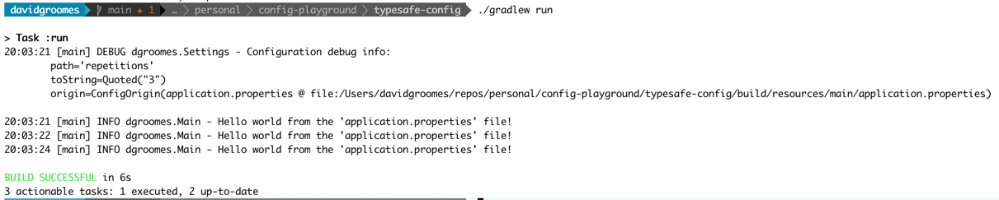

# typesafe-config

Examples using the pure-Java configuration library [*Typesafe Config*](https://github.com/lightbend/config).

## Description

*Typesafe Config* is a special library because it is featureful without dependencies. This is an exciting proposition.  

## Instructions

* Use Java 11
* Run the program:
  * `./gradlew run`
* You should see something like this:
  

## Wish List

General clean-ups, TODOs and things I wish to implement for this project:

* Overwrite the config with an environment variable
* Add tests

## Reference

* [Typesafe Config official example programs](https://github.com/lightbend/config/tree/main/examples/java)
  * The official repos has terrific examples apps that show simple and advanced ways to use the library.
* [Typesafe Config: *HOCON.md*](https://github.com/lightbend/config/blob/main/HOCON.md)
  * The official repo includes a great description of the HOCON file format (i.e.`.conf` files) 
